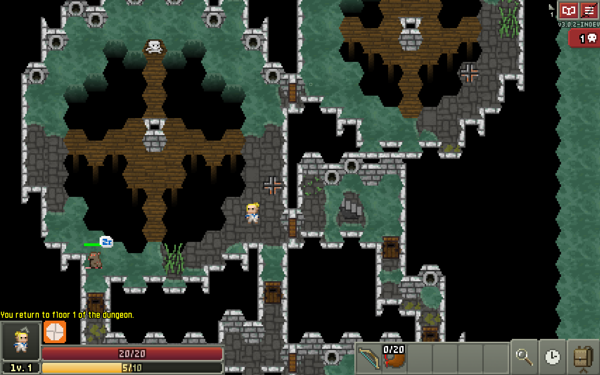

# Hexagonal Pixel Dungeon

[Hexagonal Pixel Dungeon](https://shatteredpixel.com/shatteredpd/) is an open-source traditional roguelike dungeon crawler with randomized levels and enemies, and hundreds of items to collect and use. It's based on the [source code of Shattered Pixel Dungeon](https://shatteredpixel.com/shatteredpd), by [Evan Debenham](https://shatteredpixel.com/blog/), which is based on the [source code of Pixel Dungeon](https://github.com/00-Evan/pixel-dungeon-gradle), by [Watabou](https://www.watabou.ru).

If you like this game, please consider support **ORIGINAL** authors:
* [Evan Debenham](https://www.patreon.com/ShatteredPixel)
* [Wataboi](https://pixeldungeon.watabou.ru/#donate)

### UI Examples:



### Getting started

If you'd like to work with the code, you can find the following guides in `/docs`:
- [Compiling for Android.](docs/getting-started-android.md)
    - **[If you plan to distribute on Google Play please read the end of this guide.](docs/getting-started-android.md#distributing-your-apk)**
- [Compiling for desktop platforms.](docs/getting-started-desktop.md)
- [Compiling for iOS.](docs/getting-started-ios.md)
- [Recommended changes for making your own version.](docs/recommended-changes.md)

### Hexagonal Transformation Documentation

This fork transforms Shattered Pixel Dungeon from a square grid to a hexagonal grid. Key documentation:

- **[AI Agent Guide](AI_AGENT_GUIDE.md)** - Comprehensive project vision, goals, and development guidelines
- **[Hexagonal Coordinates Technical Doc](docs/hexagonal/HEXAGONAL_COORDINATES.md)** - Detailed technical documentation of the coordinate system implementation
- **[Quick Reference & TODO](docs/hexagonal/dt.md)** - Development notes and task list
- **[WARP Guide](WARP.md)** - Development commands and architecture overview

Quick start for development:
```bash
# Desktop (fastest for development)
./gradlew desktop:debug

# Android debug build
./gradlew android:assembleDebug
```